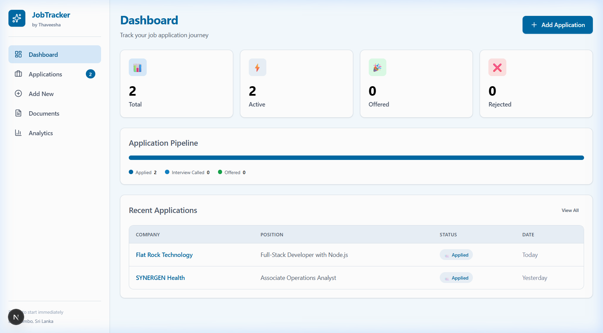
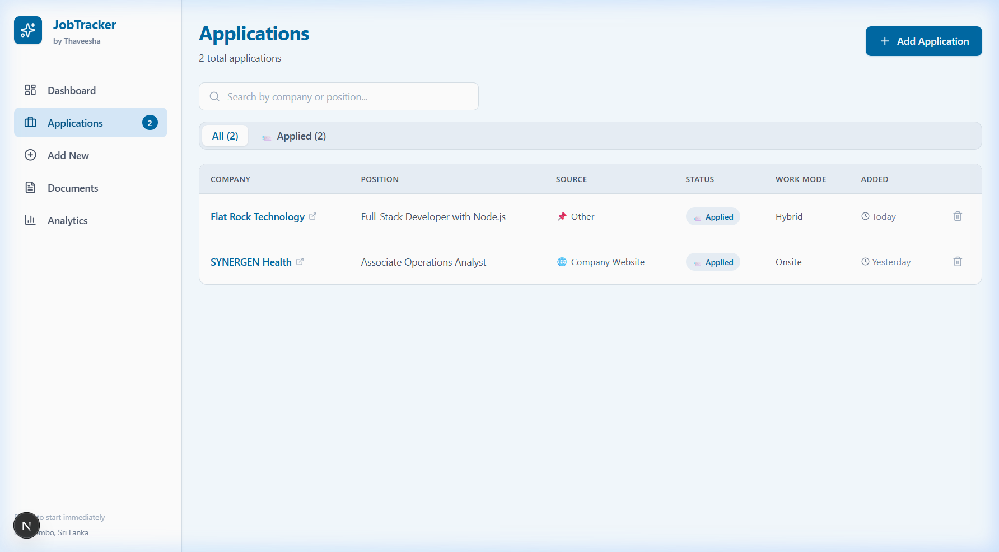
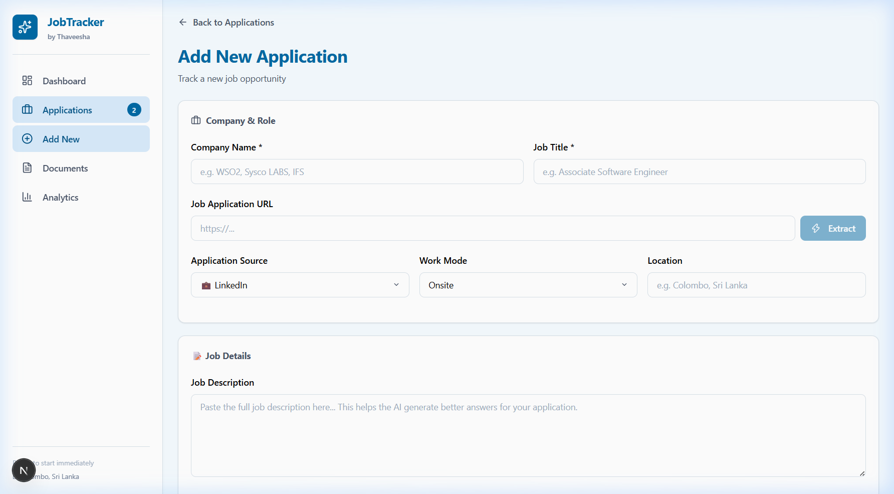
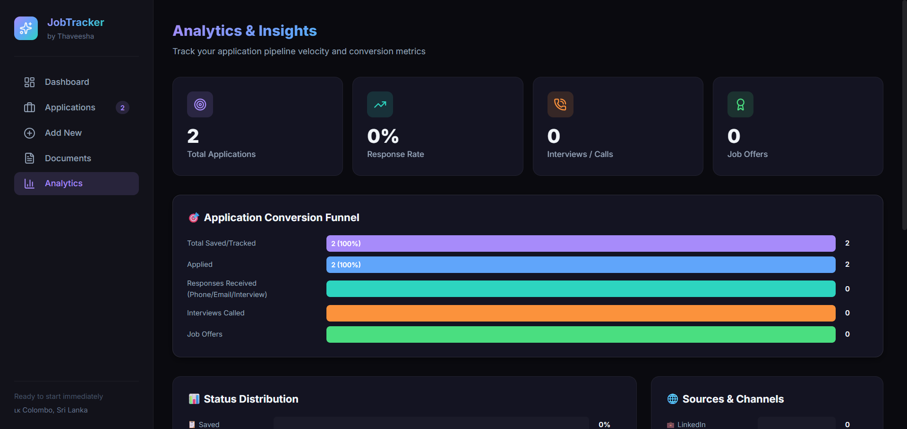

# 🚀 Job Applications Tracker

A polished, dark-themed full-stack job application tracker with AI-assisted form answering, tailored interview preparation, and document management. Built for tracking Software Engineer, Associate SE, and Internship applications across Sri Lanka and globally.

> **Live Demo:** [https://job-applications-tracker-gules.vercel.app](https://job-applications-tracker-gules.vercel.app) _(deploy your own below)_

---

## ✨ Features at a Glance

| Feature                         | Description                                                                                             |
| ------------------------------- | ------------------------------------------------------------------------------------------------------- |
| 📊 **Interactive Dashboard**    | Real-time metrics, conversion funnel, pipeline bar, recent activity feed                                |
| 🎯 **AI Form Answer Generator** | Personalized, human-sounding answers using your full profile, degree, internship & projects             |
| 🧠 **Tailored Interview Prep**  | Categorized questions (Technical, Behavioral, Company-Specific) with talking points & practice tracking |
| 📁 **Document Manager**         | Previews & one-click downloads for CV, transcripts, certificates, results                               |
| 📈 **Analytics & Insights**     | Status distribution, channel success metrics, in-demand skills radar                                    |
| ☁️ **Cloud-Native PostgreSQL**  | Neon serverless DB — zero local setup, works on Vercel instantly                                        |

---

## 📸 Screenshots

### Main Dashboard



### Applications Management



### Add New Application (with AI URL Extraction)



### Analytics & Insights



---

## 🛠️ Tech Stack

| Layer          | Technology                                                             |
| -------------- | ---------------------------------------------------------------------- |
| **Framework**  | Next.js 15 (App Router, Turbopack)                                     |
| **Language**   | TypeScript 5                                                           |
| **Database**   | PostgreSQL (Neon serverless) + Prisma ORM                              |
| **AI**         | OpenRouter API (DeepSeek, Llama, Nemotron, Gemma)                      |
| **Styling**    | Custom CSS Design System — Glassmorphism, Gradient accents, Dark theme |
| **Icons**      | Lucide React                                                           |
| **Deployment** | Vercel (zero-config)                                                   |

---

## 🚀 Deploy Your Own (2 minutes)

### 1. Prerequisites

- **GitHub account** — [github.com](https://github.com)
- **Neon account** (free) — [console.neon.tech](https://console.neon.tech)
- **OpenRouter API key** (free) — [openrouter.ai](https://openrouter.ai)
- **Vercel account** — [vercel.com](https://vercel.com)

### 2. Neon Database (30 sec)

1. Create project → name it `job-tracker`
2. **Main branch** → Copy **Pooled connection** → save for Vercel
3. **Dev branch** → Create branch `dev` → Copy **Direct connection** → save for local

### 3. One-Click Deploy

[](https://vercel.com/new/clone?repository-url=https://github.com/ThaveeshaSonnadara/job-applications-tracker)

Or manually:

1. Fork this repo → `github.com/YOUR_USERNAME/job-applications-tracker`
2. **Vercel** → "Add New Project" → Import fork
3. **Environment Variables:**
   ```env
   DATABASE_URL=postgresql://...pooler... (Neon MAIN branch Pooled)
   OPENROUTER_API_KEY=sk-or-v1-...
   AI_MODEL=nvidia/nemotron-3-ultra-550b-a55b:free
   ```
4. Deploy → Runs migration automatically

### 4. Local Development

```bash
git clone https://github.com/ThaveeshaSonnadara/job-applications-tracker.git
cd job-applications-tracker

# .env.local - use Neon DEV branch Direct connection
DATABASE_URL="postgresql://... (dev branch Direct)"
OPENROUTER_API_KEY=sk-or-v1-...
AI_MODEL=nvidia/nemotron-3-ultra-550b-a55b:free

npm install
npx prisma migrate dev --name init
npm run dev
```

Open [http://localhost:3000](http://localhost:3000)

---

## 📁 Project Structure

```
app/
├── prisma/
│   ├── schema.prisma          # Data models
│   ├── migrations/            # SQL migrations
│   └── config.js              # Prisma 7+ config
├── src/
│   ├── app/
│   │   ├── page.tsx           # Dashboard
│   │   ├── analytics/page.tsx # Analytics & insights
│   │   ├── applications/      # CRUD + AI features
│   │   ├── documents/page.tsx # Document manager
│   │   └── api/               # AI endpoints (extract, answer, interview)
│   ├── components/
│   │   └── Sidebar.tsx        # Navigation
│   ├── lib/
│   │   ├── db.ts              # Prisma client (lazy proxy)
│   │   ├── ai.ts              # OpenRouter + extraction
│   │   └── utils.ts           # Helpers
│   └── globals.css            # Design system tokens
├── DESIGN.md                  # Full design specification
└── PRODUCT.md                 # Product context
```

---

## 📝 Document Guidelines (Sri Lankan Applications)

| Document                               | When to Submit                  |
| -------------------------------------- | ------------------------------- |
| **CV - Thaveesha Sonnadara [SE].pdf**  | Always attach                   |
| **Degree Transcript Screenshot.png**   | Proof of degree requested       |
| **Internship Confirmation Letter.pdf** | Proof of experience requested   |
| **Birth Certificate Original.pdf**     | HR onboarding / ID verification |
| **GCE A/L & O/L Results**              | Only when explicitly requested  |

---

## 🎨 Design System Highlights

- **Gradient Signature:** Deep Amethyst → Clear Azure → Seafoam (page titles, primary buttons, stat cards)
- **Glassmorphism:** Translucent cards with 20px backdrop blur at rest; colored glow on interaction
- **Semantic Colors:** 7 status colors with paired dim variants (15% opacity) for badges
- **Typography:** Inter (800 display w/ gradient fill, 600 labels w/ tracking, 400 body) + JetBrains Mono
- **Motion:** Stagger fade-in, transform-based transitions, no layout thrash

See [DESIGN.md](DESIGN.md) for full specification.

---

## 📄 License

MIT — feel free to use, modify, and deploy for your own job search.

---

**Built with care by [Thaveesha Sonnadara](https://github.com/ThaveeshaSonnadara)** — tracking applications so you don't have to.